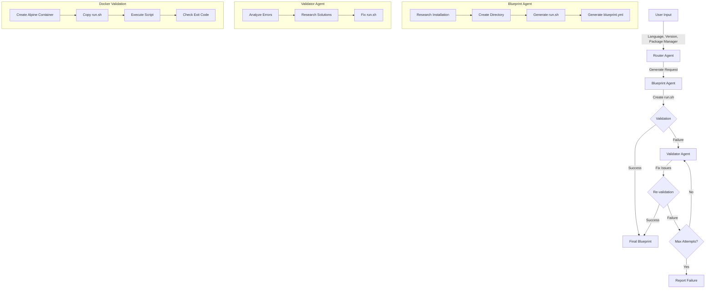

# Blueprint Generator

A multi-agent system for generating, validating, and fixing technology installation blueprints.

## Overview

Blueprint Generator is an AI-powered tool that creates reliable installation scripts for various programming languages and technologies. It uses a multi-agent architecture to:

1. Generate installation scripts (`run.sh`) for specified technologies
2. Validate the scripts by running them in Docker containers
3. Fix any issues that arise during validation

## Workflow Diagram



## Features

- **Multi-Agent Architecture**: Specialized agents for generation, validation, and fixing
- **Docker-Based Validation**: Tests scripts in real Alpine containers
- **Cross-Platform Support**: Creates scripts that work on both Alpine and Debian-based systems
- **Automatic Fixing**: Identifies and resolves issues in failed scripts
- **Configurable Retry Logic**: Attempts multiple fixes before giving up

## Installation

```bash
# Clone the repository
git clone https://github.com/yourusername/blueprint-generator.git
cd blueprint-generator

# Install dependencies
pip install -r requirements.txt
```

## Usage

```bash
# Generate a blueprint for Python 3.11 with PyPI
python main.py python 3.11 pypi

# Generate a blueprint for Node.js 18 with NPM
python main.py node 18 npm

# Generate a blueprint for Java 21 with Maven
python main.py java 21 maven

# Specify maximum number of attempts
python main.py python 3.12 pypi --max-attempts 5
```

## Project Structure

```
.
├── agents.py         # Agent definitions and router logic
├── config.py         # Configuration settings
├── examples/         # Example scripts and blueprints
├── main.py           # Command-line interface
├── models.py         # Data models and enums
├── setup/            # Generated blueprints
│   ├── java-21-maven/
│   ├── node-18-npm/
│   ├── python-3.11-pypi/
│   └── ...
├── tools.py          # Agent tools for generation and validation
└── utils.py          # Utility functions
```

## How It Works

1. **User Input**: The user specifies a technology, version, and package manager
2. **Router Agent**: Orchestrates the workflow between specialized agents
3. **Blueprint Agent**: Researches and creates an initial installation script
4. **Docker Validation**: Tests the script in an Alpine container
5. **Validator Agent**: If validation fails, analyzes errors and fixes the script
6. **Retry Logic**: The process repeats until success or the maximum number of attempts is reached

## Key Components

### Agents

- **Blueprint Agent**: Creates initial installation scripts based on technology specifications
- **Validator Agent**: Analyzes failed scripts, identifies issues, and provides fixes
- **Router Agent**: Coordinates the workflow between agents and tracks progress

### Tools

- **Docker Integration**: Validates scripts in isolated containers
- **DuckDuckGo Search**: Allows agents to research installation methods
- **File Operations**: Creates directories and manages script files
- **YAML Generation**: Creates blueprint configuration files

## Contributing

Contributions are welcome! Please feel free to submit a Pull Request.

1. Fork the repository
2. Create your feature branch (`git checkout -b feature/amazing-feature`)
3. Commit your changes (`git commit -m 'Add some amazing feature'`)
4. Push to the branch (`git push origin feature/amazing-feature`)
5. Open a Pull Request

## License

This project is licensed under the MIT License - see the LICENSE file for details.